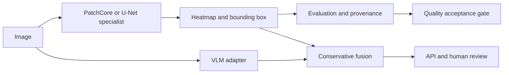

# MVIS — Industrial visual anomaly localization

A local-first vision pilot that investigates why image-level anomaly detection can succeed while defect localization fails.

## Problem

An anomaly score is insufficient when an operator needs a reviewable defect location. MVIS evaluates classification, spatial overlap, resource cost, and the validity of the evaluation protocol separately.

## System



The API supports `vlm_only`, `specialist_only`, and `fused`. In a fused conflict, the bounding box comes from the specialist and the text result requires human review.

## Baseline, failures and experiments

| Route | Historical result | Engineering interpretation |
|---|---|---|
| Whole-image PatchCore | Macro-F1 0.78125; localization 0/9 positives | Classification signal did not preserve thin-defect geometry. |
| Whole-image post-processing | 1,152 candidates; localization still 0/9 | Post-processing did not recover information lost by resizing. |
| Tiled PatchCore | Localization 2/9 | Better geometry helped partially. |
| Supervised U-Net | Localization 6/9 | Pixel supervision improved localization with annotation and latency costs. |
| Corrected entity-grouped CV | U-Net Acc@IoU 0.7451; entity-cluster 95% CI [0.6226, 0.8627] | Internal validation after correcting global candidate selection bias. |

The historical test participated in route comparison. It is not an independent external holdout. The CV correction reduced Pixel Dice from **0.4525 to 0.2337** and Box F1 from **0.4000 to 0.3016**; the lower results are retained.

Read the chain: [baseline](docs/experiments/baseline.md) → [localization failure](docs/experiments/patchcore-localization-failure.md) → [U-Net repair](docs/experiments/unet-repair.md) → [CV correction](docs/experiments/cross-validation-bias.md).

## Engineering decisions and trade-offs

- [Use supervised localization](docs/decisions/001-supervised-localization.md): U-Net requires masks and historical P50 latency was 147.3 ms versus 7.3 ms for whole-image PatchCore. PatchCore remains a rollback path.
- [Isolate selection within folds](docs/decisions/002-nested-selection.md): grouping entities is insufficient if candidates were preselected on entities that later enter outer folds.
- [Separate serving from quality acceptance](docs/decisions/003-quality-attestation.md): a loadable model and healthy API do not constitute production approval.

## Ablation boundaries

The [route comparison](docs/experiments/ablation.md) changes geometry, supervision and architecture together. It is not a pure component ablation. Current v2 internal CV reports tiled PatchCore Acc@IoU 0.0196 and U-Net 0.7451; no unmeasured causal gain is assigned to individual components.

## Reproduce

```bash
uv sync --group dev
uv run pytest -q
docs/deployment/mvis.sh serve mock vlm_only
```

The audit run on 2026-09-15 produced **278 passed, 8 skipped, 12 subtests passed**. [Validation scope](docs/experiments/validation.md) distinguishes contract tests from historical model experiments. The fresh-clone dependency/path failure and repair are recorded in [the failure log](docs/failures/003-clean-checkout.md).

Full training/inference needs KSDD data, weights and manifests that are not in Git. Follow the [algorithm report](docs/model/phase8_algorithm_report.md) and [corrected methodology report](docs/model/phase8_1_methodology_report.md). For real serving, supply the verified specialist manifest and follow the [deployment guide](docs/deployment/README.md); real mode does not silently fall back to Mock.

## Limitations

KSDD has 48 physical entities in one controlled domain. The historical test influenced route choice. Fragmented masks, missed defects and false-positive boxes remain. Data licensing, external holdout collection and factory acceptance are outstanding. All model-quality results retain `internal_pilot_validation`, `external_holdout=false`, and `production_ready=false`.

MVIS focuses on **model behavior, training and evaluation**. [VisionQC](https://github.com/wangkeyu-u/VisionQC) addresses downstream ModelOps, human review and MES/QMS workflow boundaries.

## AI-assisted development

[AI assistance and ownership](docs/AI_ASSISTED_DEVELOPMENT.md) records this revision's scope. [Decisions](docs/decisions/), [failures](docs/failures/) and retained reports make the technical choices inspectable; historical attribution and negative results remain available.
