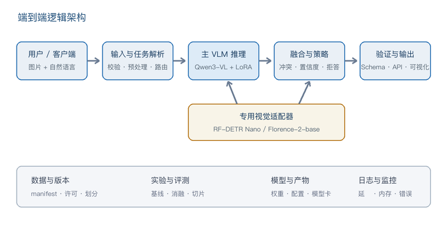

# MVIS：笔记本可运行的工业视觉多模型系统

MVIS（Multimodal Visual Inspection System）是一个面向工业表面缺陷检测与视觉合规审查的本地优先项目。它不是单一模型 Demo，而是把数据治理、视觉定位、VLM 解释、评测协议、质量门禁、API 与 Web UI 组成一条可审计的工程链路。

> 当前定位：**面试/研究用 internal pilot**。系统可运行，修订后的实体分组交叉验证有效，但没有外部留出集，因此明确保持 `production_ready=false`。

## 项目亮点

- **轻量可复现**：U-Net（ResNet-18 编码器）单次训练约 2 分钟、峰值约 1.5 GB，适配 16 GB Apple Silicon 笔记本。
- **从失败中迭代**：如实保留零样本 VLM 的 `Macro-F1=0`、QLoRA Metal OOM、整图 PatchCore 定位失败，再通过 tiled U-Net 修复核心问题。
- **防数据泄漏**：48 个实体的 Group K-Fold；第 8.1 阶段移除全局候选筛选污染，置信区间按实体聚类 bootstrap。
- **多模型协同**：specialist 负责可验证 bbox，VLM 负责解释；冲突时保守拒答并要求人工复核。
- **企业级门禁**：数据许可、模型指纹、评测 attestation、资源上限、回滚兼容与 Mock/真实成绩隔离均 fail closed。
- **完整工程交付**：FastAPI、Web UI、结构化输出、离线评测、可复现报告、286 项 Python 测试和 24 项 Node 子测试。

## 修订后的核心结果

KSDD pilot 共 383 张图、48 个物理实体。以下是严格 `ksdd_entity_grouped_nested_cv_v2` 的 383 条折外预测汇集结果，不是 external holdout：

| 模型 | Acc@IoU 0.5 | 实体聚类 95% CI | Macro-F1 | Box F1 | Pixel Dice |
|---|---:|---:|---:|---:|---:|
| Tiled PatchCore | 0.0196 | [0.0000, 0.0612] | 0.7618 | — | — |
| U-Net / ResNet-18 | **0.7451** | **[0.6226, 0.8627]** | **0.9724** | 0.3016 | 0.2337 |

`Acc@IoU` 的提升较稳定，但 Pixel Dice 和 Box F1 仍暴露轮廓碎裂、误出框问题。历史 test 的 `6/9` 只作为路线选择证据，不再包装为无偏验收成绩。方法和限制见[第 8.1 阶段方法学修订报告](docs/model/phase8_1_methodology_report.md)。

## 系统架构



请求通过统一 API 进入三种模式：

- `specialist_only`：运行 PatchCore 或 U-Net 定位；
- `vlm_only`：运行视觉语言模型做结构化判断与解释；
- `fused`：融合两路结果，bbox 只能来自 specialist，冲突时返回 `uncertain`。

## 快速开始

要求 Python 3.11–3.13、[uv](https://docs.astral.sh/uv/)；Node.js 仅用于前端测试。

```bash
git clone https://github.com/wangkeyu-u/mvis-industrial-vision-pilot.git
cd mvis-industrial-vision-pilot
uv sync --locked --group dev --extra specialist
docs/deployment/mvis.sh test-all
docs/deployment/mvis.sh serve mock vlm_only
```

服务默认监听 `http://127.0.0.1:8001`：

```bash
curl -s http://127.0.0.1:8001/health/ready
curl -s http://127.0.0.1:8001/v1/models
```

在另一个终端提交请求：

```bash
curl -sS -X POST http://127.0.0.1:8001/v1/analyze \
  -F 'image=@your-image.jpg;type=image/jpeg' \
  -F 'query=检查表面缺陷并返回有根据的定位' \
  -F 'analysis_mode=fused' \
  -F 'options={"temperature":0,"seed":20260808,"max_tokens":128}'
```

Web Demo 启动方式见[一键演示说明](docs/demo/one_click_demo.md)。

## 测试与复现

```bash
# 全量静态检查、Python 测试和 Node 前端测试
docs/deployment/mvis.sh test-all

# 无本地模型时验证服务契约
docs/deployment/mvis.sh preflight mock vlm_only

# 生成 fixture-only 评测包；不能作为模型成绩
uv run python -m src.evaluation.cli \
  --ground-truth tests/evaluation/fixtures/system_ground_truth.jsonl \
  --predictions tests/evaluation/fixtures/system_predictions.jsonl \
  --output /tmp/mvis-report.json \
  --fixture-only
```

GitHub Actions 只依赖公开源码和 fixtures；真实数据、模型权重与运行工件不会提交。完整训练和评测需按[数据说明](docs/data/README.md)准备 KSDD，并满足其许可证限制。

## 真实模型模式

真实模式不会静默回退到 Mock。运行前必须显式提供本地、可核验的 specialist manifest：

```bash
export MVIS_MODEL_MODE=real
export MVIS_ANALYSIS_MODE=fused
export MVIS_SPECIALIST_MANIFEST=artifacts/model/phase8_1/specialist_manifest_unet.json
export MVIS_SPECIALIST_QUALITY_STATUS=pilot_candidate
docs/deployment/mvis.sh preflight real fused
```

只有与 model/config/revision/data/prompt provenance 完全绑定的签名 evaluator attestation 才能使 `quality_accepted=true`。本项目现阶段没有该生产验收证据。

## 仓库结构

```text
src/
  api/             FastAPI 接口与 CLI
  core/            配置、契约、质量门禁、服务编排
  data/            数据导入、去重、实体隔离划分、许可校验
  evaluation/      指标、bootstrap、嵌套 CV、失败分析
  inference/       VLM/PatchCore/U-Net 适配与融合
  training/        轻量训练与实验记录
ui/                本地 Web UI
tests/             Python、集成与 Node 契约测试
configs/           数据、模型、评测与服务的冻结配置
docs/              方法学、部署、QA 与面试证据
```

## 面试阅读顺序

1. [第 8.1 阶段方法学修订报告](docs/model/phase8_1_methodology_report.md)：为什么主动推翻偏乐观结果；
2. [实体分组评测协议](docs/evaluation/phase8_1_entity_grouped_protocol.md)：如何避免实体泄漏和选择污染；
3. [定位失败分析](docs/qa/phase8_localization_failure_report.md)：如何从 0/9 定位到可用基线；
4. [面试讲稿](docs/qa/phase8_interview_script.md)：三分钟项目陈述和追问口径；
5. [部署手册](docs/deployment/README.md)：运行模式、错误码、ModelOps 与回滚。

## 已知边界

- KSDD 只有 48 个实体、50 张正例，且来自单一受控域；
- 没有未参与路线决策的外部 holdout；
- 像素级轮廓质量和负例误出框仍需改进；
- KSDD 为 CC BY-NC-SA 4.0，只能用于当前非商业 pilot；
- 仓库不包含数据、第三方模型权重、checkpoint 或本地运行工件。

第三方组件与数据许可边界见 [THIRD_PARTY_NOTICES.md](THIRD_PARTY_NOTICES.md)。安全问题请参考 [SECURITY.md](SECURITY.md)，参与开发请阅读 [CONTRIBUTING.md](CONTRIBUTING.md)。
